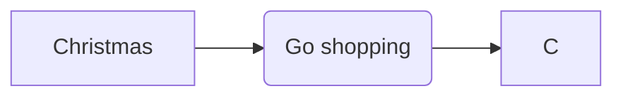

# Introduction

## Overview

This series of lessons will build up the knowledge required to effectively apply Deep Learning algorithms to real-world problems. We encourage anyone reading to read through the Mathematics lectures so that you have sufficient background for the following theory. Specifically we recommend:

1. Mathematics/Calculus/Derivatives
2. Mathematics/Calculus/Partial Derivatives
3. Mathematics/Linear Algebra/Matrix Multiplication

to get you started. We will cover the basics of Deep Learning in this series, saving more advanced theories for the advanced lecture series. We may briefly discuss specific domains such as Computer Vision, Natural Language Processing, and Deep Reinforcement Learning, but full treatments on those subjects will be saved for their respective series. Feel free to dive into those lectures **after** completing this series first. Pre-maturely investigating those fields without sufficient background is not recommended.

### Terminology

Before moving on we should define some common terms that we will use throughout the series.

1. The inputs to a function are typically referred to as **features**. This can take the form of pixels in an image, tokens in a piece of text, or observations from an environment. Our objective in Machine Learning is to train a model to identify patterns in the features (data) whether those patterns are complex or simple. Deep Learning is typically used when the patterns are complex and require more modeling capacity to capture.
2. In supervised learning problems, each input is mapped to a value (an integer, real number, etc.). We call this value the **label** and can be a class if we are working on a classification problem, a float if we are estimating a value, or some other desired output. The correct label is often referred to as the **ground truth**.

It would be prudent to also introduce some symbology that will be used throughout the course. First is the mapping symbol:

$$ f: X \rightarrow Y $$

this reads "$f$ maps $X$ to $Y$". The set $X$ is called the **domain** and the set $Y$ is called the **co-domain** of the function $f$. If the name of the function is not required then you will sometimes see the notation $x \mapsto y$ instead of $f(x) = y$. For instance you would write $x \mapsto x^2$ for $f(x) = x^2$ (in Computer Science terms this is the equivalent of an anonymous function).

Next is the probability symbols $\Pr\{ y \mid x\}$ and $\text{P}(y \mid x)$, both of which read "the probability of $y$ given $x$". We will use the symbol $\Pr$ instead of $\text{P}$ for clarity. The solid line in the middle of the inputs represents a conditional probability, i.e. the probability event $y$ occurs given event $x$ has occurred. Sometimes you will see just a single input $\Pr\{x\}$ which reads the "probability of event $x$". For instance if we model the probability of a coin flip resulting in the event heads or tails we would write that the probability of the event "heads" is

$$\Pr\{\text{heads}\} = 0.5$$

given a fair coin. On the other hand we could write this as a conditional probability given we previously flipped heads,

$$\Pr\{\text{heads} \mid \text{heads}\} = 0.5.$$

Since coin flips should be independent of each other we would drop the "given the event heads" part of the expression and simply write

$$\Pr\{\text{heads} \mid \text{heads}\} = \Pr\{\text{heads}\} = 0.5.$$

If two events $A$ and $B$ are **independent**, then we can reduce

$$\Pr\{A \mid B \}=\Pr\{A\}$$

### Paradigms

Deep Learning can be applied to many problem paradigms. When thinking of a use case for Deep Learning models, you should check that the features contain complexities that traditional Machine Learning models, such as Random Forest and Naive Bayes, are unable to model. You should always select the simplest model that can correctly model your problem, as more complex models introduce errors (each model has an inductive bias) that require large amounts of data to overcome. Keep in mind that there is no "best" choice for all problems (No free lunch theorem). We will examine this further later. Three main paradigms will be covered in this series, each to different degrees. Our primary focus will be on supervised learning, but we will touch on semi-supervised and reinforcement learning as well. Each will be briefly described below.

#### Supervised Learning

In supervised learning, we provide the model with examples of features and labels. In a supervised setting, we have a perfect oracle that can tell the learner which labels are assigned to each input with the aim of generalizing the model to correctly operate on unseen data. The diagram below shows four examples of inputs mapped to outputs. Each of these examples will be provided to the model during training time, with a few examples set aside to test the models performance on new data.

For supervised learning to be effective, we need the training data to be properly formed, removing inconsistencies (such as one feature having multiple labels), and insuring that the training set is representative of the real-world problem we are trying to solve. Bad data is worse than no data, since we are can un-learn good weights with bad datum. When working with supervised learning, the data sets are often hand labeled by experts. In this scenario, human labelers can mistakenly introduce bias into their labels, or mis-label features in error. For this reason it is a good idea to test the quality of your training set.

You should be wary of four major issues when working with supervised learning:

**Bias-variance tradeoff**

Suppose we have multiple sets we are using for training, each equally representative of the real-world data we are modeling. An algorithm (recall that an algorithm is the device we use to train/fit a machine learning model) is biased toward a specific feature if the model is consistently wrong in the labeling of said feature. A learning algorithm has high variance if the model predicts different labels for the same feature. The prediction error of a model is the sum of the bias error and variance error. Unfortunately there is a tradeoff between bias and variance. If the model is too flexible (has too many trainable parameters), it will fit each piece of training data differently, increasing the variance. If the model is too rigid (not enough parameters), it will not fit the training data very well, increasing the bias. It is our job as Machine Learning engineers to find the model with just enough complexity to fit the data, but make it low enough in variance to predict unseen data.

**Modeling Capacity**

If the complexity of the prediction function is high, meaning we have numerous parameters that we are using to model the interaction between the features and labels, then we need large quantities of good data to optimize the weights of the "true" function (the predictor). On the other hand, when our prediction function is simple (say for instance a linear model), then we can often learn from a small amount of data.

**Feature Dimensionality**

Richard E. Bellman coined the phrase "curse of dimensionality" when referring to the ratio of data complexity to quantity. When out feature space has relatively few dimensions, then we do not need as much data. As the complexity of our input features grows, so too does the need for data. Take for example Natural Language Processing. Setting aside the problem of modeling capacity, it would be impossible to train a deep neural net to model human language off of only a few examples. Foundational models such as GPT-4 and Mixtral-8x7b require trillions of examples to properly model the complex patterns found in human language. When analyzing your training set, consider how much training data you have in comparison to the dimensionality of the features. As the dimensionality increases, the extra dimensions can throw off the algorithm, increasing the variance.

If you do not need as many dimensions to model your problem, then consider using a dimensionality reduction algorithm such as PCA or t-SNE.

**Output Noise**

Since humans are error-prone, hand labeled data should be checked for mislabeled features. Data that is mislabeled will introduce modeling errors, since the model will not know which label is correct. In this situation, it is better to remove the mislabeled points. No data is better than malformed data.

**Overfitting**

Trying to model the training data too closely can lead to overfitting. When you overfit a model it is not able to generalize to unseen data. A common example is when you use a higher-degree polynomial for your function. The higher degree polynomial will have more degrees of freedom to fit your training data, but will perform poorly on new data. Using a training set of examples that we feed to the model to learn from and a testing set to test the model at the end, we can test for overfitting. If we achieve a high accuracy on the training set (say 97%) and only a (34%) accuracy on the test set, then we have clearly tuned our model to only predict things it has seen before. Recall that a test set is not shown to the model until training has finished and it is ready to be evaluated. The test set contains data points that are representative of the problem we are trying to solve, but have been withheld from the model so we can test performance on new data.

**Redundant Data**

If the input features are highly correlated, then certain models perform worse. For instance Random Forest models are good at detecting interactions between features, but highly correlated data can mask these interactions[^1].

**Presence of Interactions and Non-linearities**

Models that are linear perform well on data with linearities. If your data is complex, it likely is non-linear and will need some sort of mechanism to handle that interaction. Deep learning models with activation functions can handle non-linear data. We will cover that more when discussing activation functions.

#### Semi-supervised Learning

In semi-supervised learning you have a large number of un-labeled examples and a few labeled examples. This is a challenging paradigm, as it is far easier to work in the supervised learning domain where every example is labeled. Unfortunately, this is not often the case since labeling data is expensive and time consuming. Quickly hand labeling data leads to errors which is worse than having a set of high quality data. If data is abundant, yet labeling it all is too difficult then semi-supervised algorithms are ideal.

In the diagram above we can see a few points are labeled purple and others are pink. These points are the few examples of labeled data, where the white circles represent un-labeled examples that are more abundant. If we attempted to train a supervised model on the few examples that are labeled, we would likely produce a horizontal line that would cleanly separate the two sets. The problem is that line will mis-classify the points in the top set as being pink.

A better algorithm would be a clustering algorithm that (such as $k$-means) that would label nearby points. Keep in mind that the problem here is not the model complexity; a linear model would fail as would a non-linear model since the non-labeled data is not being used to train the model. The model separates the two sets in a way that is consistent with the train examples it is fed.

We will not cover semi-supervised learning in this series in any real detail. We plan to add more information on semi-supervised methods in another series in the future.

In Reinforcement Learning, an agent (a robot, an animal, or even you) interacts with an environment (a game, a system, or the world) through actions. The environment responds to these actions by providing the agent a reward signal and transitioning the state of the environment through the environment's mechanics.

An example of this is a self-driving car. In this scenario the agent is the car and the environment is the world. At every time interval the car makes a decision and takes an action. This action could be to continue driving straight, stop, make a left turn, etc. After the agent's action is taken, the environment provides some evolution of the world. For instance if the car drives straight, its location is now updated with a new location. The reward signal drives the agent toward a goal. In our scenario a reward signal can be the amount of gas expended at each time step (a reward can be negative, sometimes called a penalty), with a big payoff at the end when it reaches its destination. Deep Reinforcement Learning is out of the scope of this series and will be covered in a future series.

## What To Expect

We will focus mainly on the supervised learning case, deviating when appropriate. We will start by discussing learning algorithms and basic modeling functions, building up to more complex model architectures later in the series. We will see how each of these functions can be decomposed into building blocks that form graphs. Then we will cover loss functions and model optimizations.

[^1]: [Stack Exchange Post](https://datascience.stackexchange.com/questions/24452/in-supervised-learning-why-is-it-bad-to-have-correlated-features)

